# LAB05 - Complete Implementation Guide

**Samba 4 Active Directory on Ubuntu Server 24.04**

---

## Table of Contents

- [Sprint 1: Domain Controller Setup](#sprint-1-domain-controller-setup)
- [Sprint 2: Users, Groups, OUs & GPOs](#sprint-2-users-groups-ous--gpos)
- [Sprint 3: Shared Folders, ACLs & Automated Backup](#sprint-3-shared-folders-acls--automated-backup)
- [Sprint 4: Forest Trust Between Domains](#sprint-4-forest-trust-between-domains)
- [Sprint 5: AWS Cloud Deployment](#sprint-5-aws-cloud-deployment)
- [Appendix A: Ubuntu Desktop Client](#appendix-a-ubuntu-desktop-client)
- [Appendix B: Windows 11 Client](#appendix-b-windows-11-client)

---

## Sprint 1: Domain Controller Setup

**Duration:** 6 hours
**Objective:** Install and configure a Samba 4 Active Directory Domain Controller on Ubuntu Server 24.04.

### System Information

| Parameter | Value |
|-----------|-------|
| **Hostname** | ls05.lab05.lan |
| **Domain** | lab05.lan |
| **Realm** | LAB05.LAN |
| **NetBIOS** | LAB05 |
| **Internal IP** | 192.168.1.1/24 |
| **Bridge IP** | 172.30.20.41/25 |
| **System user** | pablo |
| **Admin password** | Admin_21 |

### Step 1: Initial IP and System Update

First, verify the current network state and update the system:

```bash
ip a
sudo apt update && sudo apt upgrade -y
```

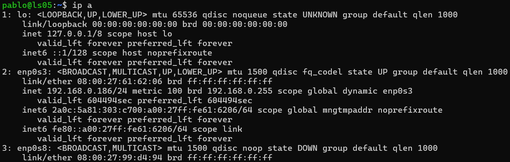

### Step 2: Set Hostname

```bash
sudo hostnamectl set-hostname ls05.lab05.lan
hostname -f
```
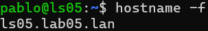

Verify:
```bash
hostnamectl
```

### Step 3: Configure /etc/hosts

```bash
sudo nano /etc/hosts
```

Content:
```
127.0.0.1 localhost
192.168.1.1 ls05.lab05.lan ls05

::1     ip6-localhost ip6-loopback
fe00::0 ip6-localnet
ff00::0 ip6-mcastprefix
ff02::1 ip6-allnodes
ff02::2 ip6-allrouters
```

Verify:
```bash
cat /etc/hosts
```

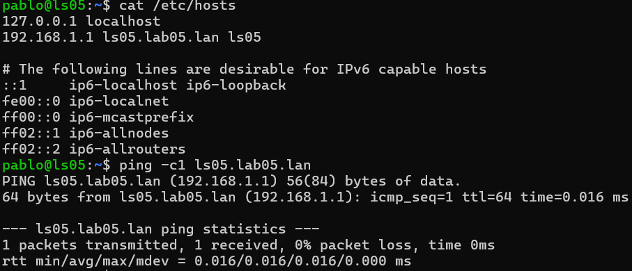

### Step 4: Network Configuration (Netplan)

The DC uses two network interfaces: one bridged for internet access, and one on the internal network for domain traffic.

```bash
sudo nano /etc/netplan/50-cloud-init.yaml
```

Configuration:
```yaml
network:
  version: 2
  ethernets:
    enp0s3:
      dhcp4: no
      addresses:
        - 172.30.20.41/25
      routes:
        - to: default
          via: 172.30.20.1
      nameservers:
        addresses: [127.0.0.1, 10.239.3.7]
        search: [lab05.lan]
    enp0s8:
      dhcp4: no
      addresses:
        - 192.168.1.1/24
```

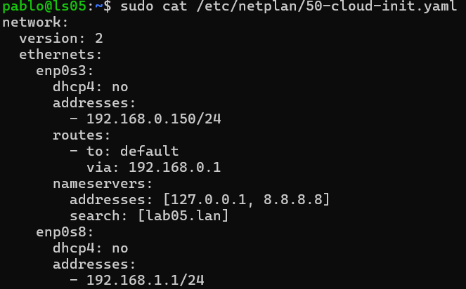

Apply and verify:
```bash
sudo netplan apply
ip a
ip route
```

> **Note:** The bridge IP and DNS forwarder depend on your environment. For a home lab, use your router IP as gateway and `8.8.8.8` as DNS forwarder.

### Step 5: Disable systemd-resolved

⚠️ **CRITICAL:** Samba needs full control of port 53 (DNS). If systemd-resolved is running, Samba cannot start its internal DNS server.

```bash
# Stop and disable systemd-resolved
sudo systemctl stop systemd-resolved
sudo systemctl disable systemd-resolved

# Remove symbolic link
sudo unlink /etc/resolv.conf

# Create manual resolv.conf
sudo nano /etc/resolv.conf
```

Content:
```
nameserver 127.0.0.1
nameserver 10.239.3.7
search lab05.lan
```

Verify port 53 is free:
```bash
sudo ss -tulnp | grep :53
# Should be empty
```

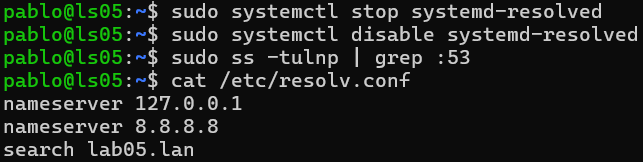

### Step 6: Install Samba and Dependencies

```bash
sudo apt install -y acl attr samba samba-dsdb-modules samba-vfs-modules \
  winbind libpam-winbind libnss-winbind libpam-krb5 krb5-config krb5-user \
  dnsutils ldap-utils smbclient
```

During installation, you will be prompted for Kerberos configuration:
- **Default realm:** `LAB05.LAN`
- **Kerberos servers:** `ls05.lab05.lan`
- **Admin server:** `ls05.lab05.lan`

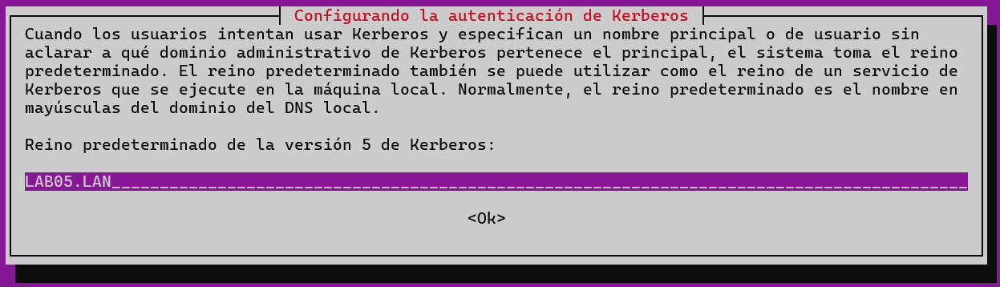

Stop the default Samba services (we will use the AD DC service instead):
```bash
sudo systemctl disable --now smbd nmbd winbind
sudo systemctl stop smbd nmbd winbind
```

### Step 7: Provision the Domain

Remove the default configuration and provision interactively:

```bash
sudo rm -f /etc/samba/smb.conf
sudo samba-tool domain provision --use-rfc2307 --interactive
```

Provisioning answers:

| Question | Answer |
|----------|--------|
| Realm | LAB05.LAN |
| Domain | LAB05 |
| Server Role | dc |
| DNS backend | SAMBA_INTERNAL |
| DNS forwarder | 10.239.3.7 |
| Administrator password | Admin_21 |

Verify generated smb.conf:
```bash
cat /etc/samba/smb.conf
```

Expected content:
```ini
[global]
    dns forwarder = 10.239.3.7
    netbios name = LS05
    realm = LAB05.LAN
    server role = active directory domain controller
    workgroup = LAB05

[sysvol]
    path = /var/lib/samba/sysvol
    read only = No

[netlogon]
    path = /var/lib/samba/sysvol/lab05.lan/scripts
    read only = No
```

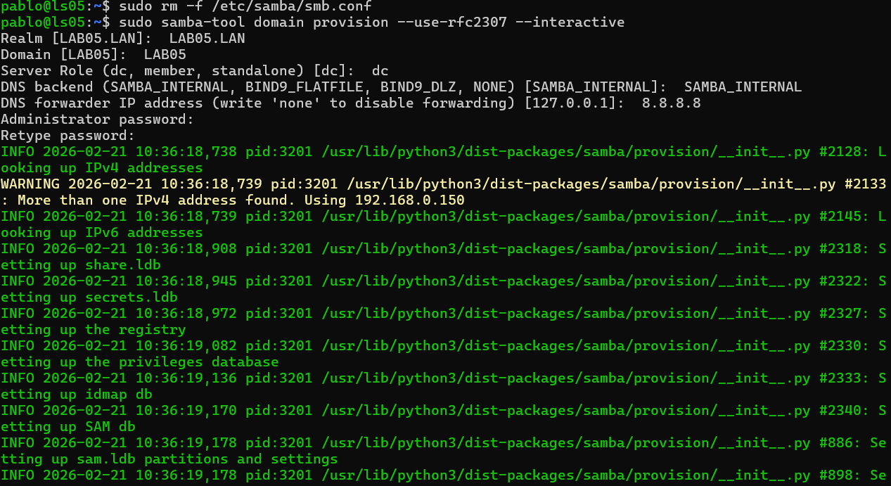

### Step 8: Configure Kerberos and Start Service

Copy the Kerberos configuration generated by Samba and start the AD DC service:

```bash
sudo cp /var/lib/samba/private/krb5.conf /etc/krb5.conf
sudo systemctl unmask samba-ad-dc
sudo systemctl enable samba-ad-dc
sudo systemctl start samba-ad-dc
sudo systemctl status samba-ad-dc
```

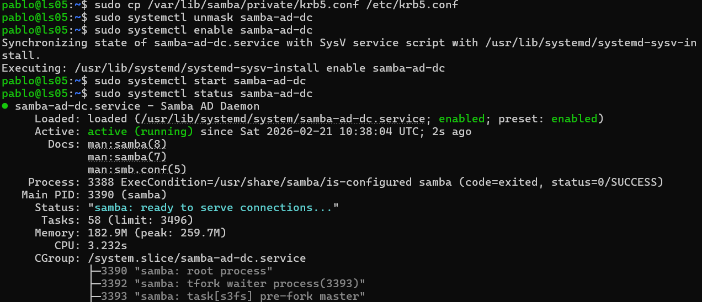

### Step 9: Full Verification

Run all verifications to confirm the domain is fully operational:

```bash
# Domain level
sudo samba-tool domain level show

# Domain info
sudo samba-tool domain info 127.0.0.1

# DNS A record
host -t A ls05.lab05.lan

# DNS SRV records
host -t SRV _ldap._tcp.lab05.lan
host -t SRV _kerberos._tcp.lab05.lan

# Kerberos authentication test
kinit administrator@LAB05.LAN
klist
kdestroy

# List default users
sudo samba-tool user list

# Verify all AD ports are listening
sudo ss -tulnp | grep -E ':(53|88|389|445|636|3268)'
```

Expected results:
- Domain level: `(Windows) 2008 R2`
- DNS records: resolve to `192.168.1.1`
- Kerberos: ticket obtained successfully
- Default users: `Administrator`, `Guest`, `krbtgt`
- Ports 53, 88, 389, 445, 636, 3268 all listening

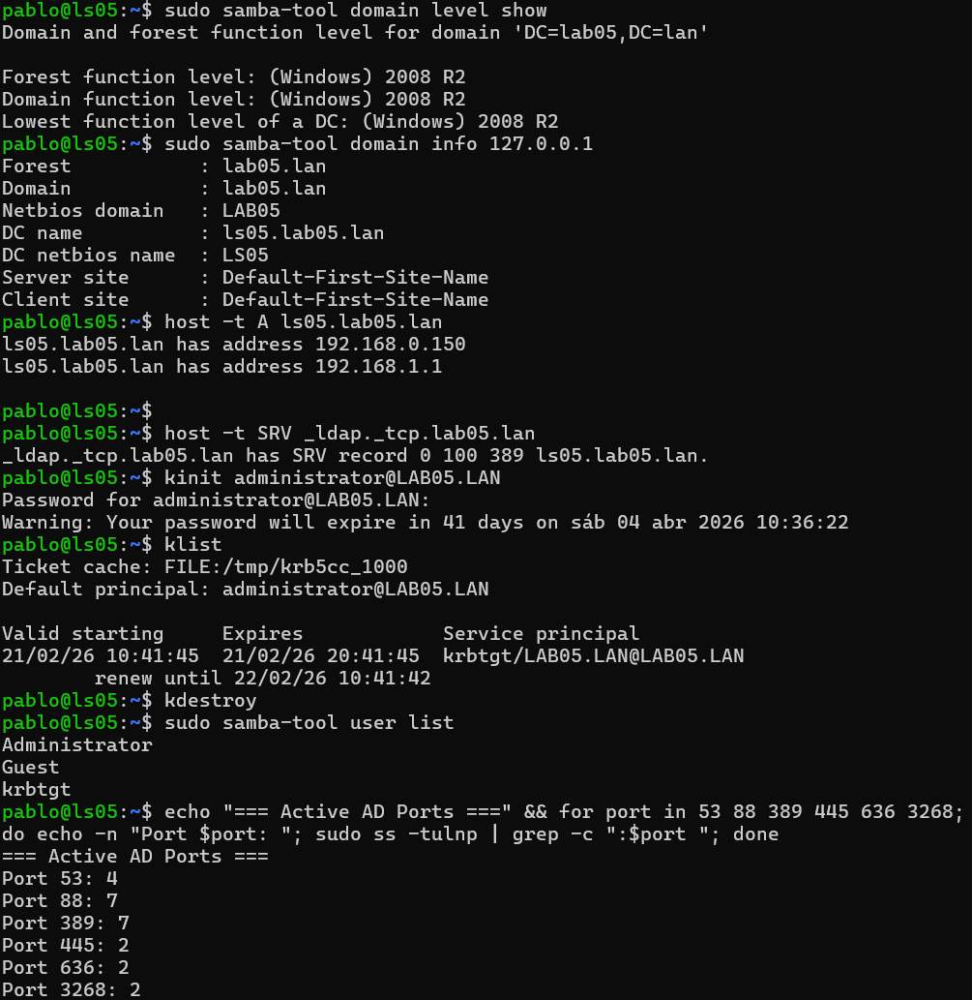

### Bonus: Process Management with Signals

Understanding process control is essential for system administration. This exercise demonstrates how to pause and resume processes using POSIX signals.

Install the `sl` command (a steam locomotive animation):
```bash
sudo apt install -y sl
```

In **terminal 1**, run the animation:
```bash
sl
```

In **terminal 2**, find the PID and send signals:
```bash
# Find the process
pgrep -x sl

# SIGSTOP (19) — freeze the process mid-animation
kill -19 $(pgrep -x sl)

# SIGCONT (18) — resume from where it stopped
kill -18 $(pgrep -x sl)
```

The locomotive freezes mid-screen when SIGSTOP is sent, then resumes exactly where it stopped with SIGCONT. The process stays in memory throughout — it is paused, not terminated.

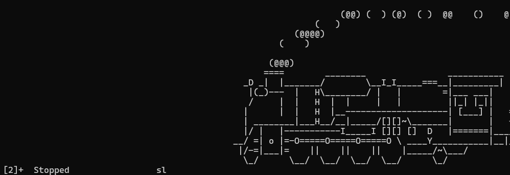

### Sprint 1 Summary

✅ System updated and initial network verified
✅ Hostname and /etc/hosts configured
✅ Dual network (Bridge + Internal) operational via Netplan
✅ systemd-resolved disabled for Samba DNS
✅ Samba 4 installed with Kerberos integration
✅ Domain lab05.lan provisioned and operational
✅ DNS, Kerberos, LDAP all verified
✅ Process management demonstrated with signals

---

## Sprint 2: Users, Groups, OUs & GPOs

**Duration:** 6 hours
**Objective:** Create the organizational structure and configure domain security policies.

### Concepts: OUs vs Groups

| Feature | Organizational Unit (OU) | Security Group |
|---------|--------------------------|----------------|
| **Purpose** | Organization + GPO application | Assign permissions to resources |
| **Contains** | Users, Groups, Computers, OUs | Only members (users) |
| **Permissions** | Cannot assign to resources | Assigned to files, shares, etc. |
| **GPOs** | Applied to OUs | Not applied to groups |

### Step 1: Create Organizational Units

```bash
sudo samba-tool ou create "OU=IT_Department,DC=lab05,DC=lan"
sudo samba-tool ou create "OU=HR_Department,DC=lab05,DC=lan"
sudo samba-tool ou create "OU=Students,DC=lab05,DC=lan"
sudo samba-tool ou create "OU=Finance_Department,DC=lab05,DC=lan"
```

Verify:
```bash
sudo samba-tool ou list
```

Expected output:
```
OU=IT_Department,DC=lab05,DC=lan
OU=HR_Department,DC=lab05,DC=lan
OU=Students,DC=lab05,DC=lan
OU=Finance_Department,DC=lab05,DC=lan
OU=Domain Controllers,DC=lab05,DC=lan
```

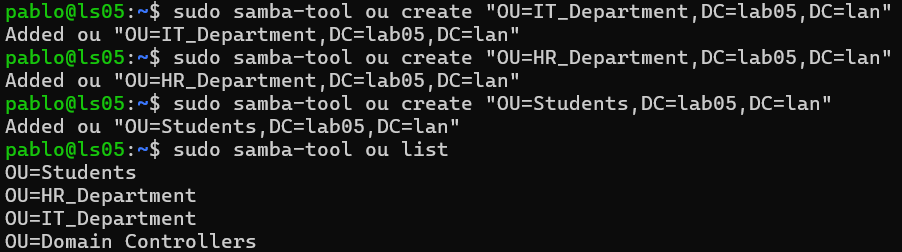

### Step 2: Create Security Groups

```bash
sudo samba-tool group add IT_Admins --groupou="OU=IT_Department"
sudo samba-tool group add HR_Staff --groupou="OU=HR_Department"
sudo samba-tool group add Students --groupou="OU=Students"
sudo samba-tool group add Finance --groupou="OU=Finance_Department"
```

Verify:
```bash
sudo samba-tool group list | grep -E "(IT_Admins|HR_Staff|Students|Finance)"
```

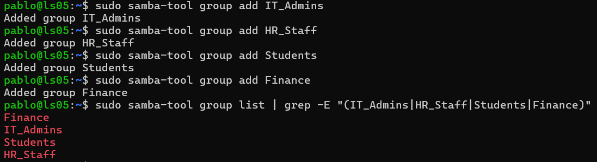

### Step 3: Create Domain Users

All users are created with a password that meets the domain policy (12+ characters, complexity enabled): `P@ssw0rd2026!`

**Students:**
```bash
sudo samba-tool user create alice 'P@ssw0rd2026!' \
  --userou="OU=Students" --given-name=Alice --surname=Wonderland
sudo samba-tool user create bob 'P@ssw0rd2026!' \
  --userou="OU=Students" --given-name=Bob --surname=Marley
sudo samba-tool user create charlie 'P@ssw0rd2026!' \
  --userou="OU=Students" --given-name=Charlie --surname=Sheen
```

**IT Admins:**
```bash
sudo samba-tool user create iosif 'P@ssw0rd2026!' \
  --userou="OU=IT_Department" --given-name=Iosif --surname=Stalin
sudo samba-tool user create karl 'P@ssw0rd2026!' \
  --userou="OU=IT_Department" --given-name=Karl --surname=Marx
sudo samba-tool user create lenin 'P@ssw0rd2026!' \
  --userou="OU=IT_Department" --given-name=Vladimir --surname=Lenin
```

**HR Staff:**
```bash
sudo samba-tool user create vladimir 'P@ssw0rd2026!' \
  --userou="OU=HR_Department" --given-name=Vladimir --surname=Malakovsky
```

**Finance:**
```bash
sudo samba-tool user create liudmila 'P@ssw0rd2026!' \
  --userou="OU=Finance_Department" --given-name=Liudmila --surname=Pavlichenko
```

Verify:
```bash
sudo samba-tool user list
```

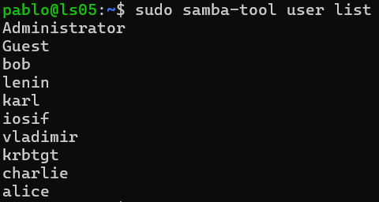

### Step 4: Assign Users to Groups

```bash
sudo samba-tool group addmembers Students alice,bob,charlie
sudo samba-tool group addmembers IT_Admins iosif,karl,lenin
sudo samba-tool group addmembers HR_Staff vladimir
sudo samba-tool group addmembers Finance liudmila
```

> **Note:** Users are separated by commas with no spaces.

Verify all memberships:
```bash
sudo samba-tool group listmembers Students
sudo samba-tool group listmembers IT_Admins
sudo samba-tool group listmembers HR_Staff
sudo samba-tool group listmembers Finance
```

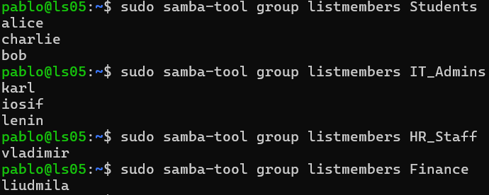

### Step 5: Configure Password Security Policy

The password policy is applied domain-wide. This is equivalent to editing the Default Domain Policy GPO in Windows Server.

**View current policy:**
```bash
sudo samba-tool domain passwordsettings show
```

**Configure all policy settings:**
```bash
# Minimum 12 characters
sudo samba-tool domain passwordsettings set --min-pwd-length=12

# Require uppercase, lowercase, numbers, symbols
sudo samba-tool domain passwordsettings set --complexity=on

# Remember last 24 passwords
sudo samba-tool domain passwordsettings set --history-length=24

# Minimum 1 day before changing password again
sudo samba-tool domain passwordsettings set --min-pwd-age=1

# Force change every 42 days
sudo samba-tool domain passwordsettings set --max-pwd-age=42

# Lock account after 5 failed attempts
sudo samba-tool domain passwordsettings set --account-lockout-threshold=5

# Lockout duration: 30 minutes
sudo samba-tool domain passwordsettings set --account-lockout-duration=30

# Reset counter after 30 minutes
sudo samba-tool domain passwordsettings set --reset-account-lockout-after=30
```

**Verify the policy is applied:**
```bash
sudo samba-tool domain passwordsettings show
```

Expected output:
```
Password complexity: on
Store plaintext passwords: off
Password history length: 24
Minimum password length: 12
Minimum password age (days): 1
Maximum password age (days): 42
Account lockout duration (mins): 30
Account lockout threshold (attempts): 5
Reset account lockout after (mins): 30
```

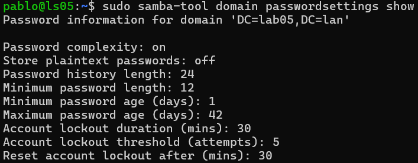

**Test the policy** — a weak password should be rejected:
```bash
# This should FAIL
sudo samba-tool user create testgpo weak123

# This should SUCCEED
sudo samba-tool user create testgpo 'SecureP@ss2026!'

# Clean up
sudo samba-tool user delete testgpo
```

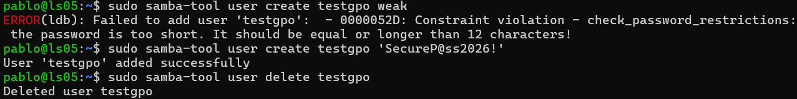

Set Administrator password to never expire:
```bash
sudo samba-tool user setexpiry Administrator --noexpiry
```

### Step 6: GPO Management

Samba 4 creates two default GPOs automatically during domain provisioning.

**List all GPOs and inspect the SYSVOL structure:**
```bash
# List all GPOs in the domain
sudo samba-tool gpo listall

# View SYSVOL directory (where GPOs are stored on disk)
sudo ls -la /var/lib/samba/sysvol/lab05.lan/Policies/

# See which container each GPO is linked to
sudo samba-tool gpo listcontainers "{31B2F340-016D-11D2-945F-00C04FB984F9}"
sudo samba-tool gpo listcontainers "{6AC1786C-016F-11D2-945F-00C04FB984F9}"
```

Default GPOs:
- **Default Domain Policy** `{31B2F340...}` → linked to `DC=lab05,DC=lan` — controls password policy
- **Default Domain Controllers Policy** `{6AC1786C...}` → linked to `OU=Domain Controllers`

GPO processing order (LSDOU): **L**ocal → **S**ite → **D**omain → **OU** — the last applied wins.

> **Important:** Samba has limited GPO editing from the command line. For advanced GPO management (desktop restrictions, software deployment, drive mapping), use **Windows RSAT** from a domain-joined Windows client: `Win+R` → `gpmc.msc`.

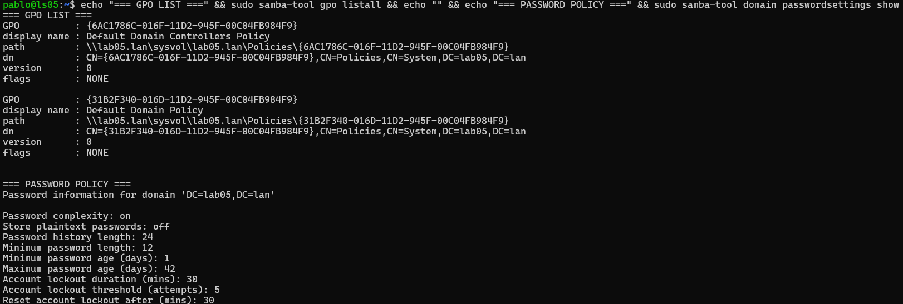

### Sprint 2 Summary

✅ 3 Organizational Units created
✅ 4 Security Groups created
✅ 8 Domain users created with policy-compliant passwords
✅ Users assigned to appropriate groups
✅ Password security policy configured and tested
✅ GPO structure inspected and verified

---

## Sprint 3: Shared Folders, ACLs & Automated Backup

**Duration:** 6 hours
**Objective:** Configure shared folders on a dedicated disk with granular permissions and automated backup.

### Concepts: Two Permission Layers

Samba applies two layers of permissions, just like Windows Server:

1. **Share-level permissions** — defined in `smb.conf` (who can connect)
2. **Filesystem permissions** — POSIX + ACLs on disk (what they can do)

**The most restrictive permission wins.**

### Permission Matrix

| Share | Finance | HR_Staff | Students | Domain Admins |
|-------|---------|----------|----------|---------------|
| **FinanceDocs** | R/W (no delete others) | ✗ | ✗ | Full Control |
| **HRDocs** | ✗ | R/W | ✗ | Full Control |
| **Public** | R | R | R | Full Control |

### Step 1: Add and Mount Dedicated Disk

Using a separate disk for shares keeps data isolated from the OS.

```bash
# Identify the new disk
lsblk

# Create partition
sudo fdisk /dev/sdb
# n → p → 1 → Enter → Enter → w

# Format with ext4
sudo mkfs.ext4 /dev/sdb1

# Create mount point and mount
sudo mkdir -p /mnt/data
sudo mount /dev/sdb1 /mnt/data

# Verify
df -h | grep sdb

# Make permanent — add to /etc/fstab
echo '/dev/sdb1 /mnt/data ext4 defaults 0 2' | sudo tee -a /etc/fstab
```

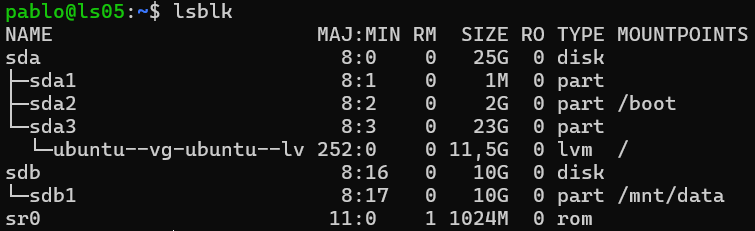

### Step 2: Create Directory Structure

```bash
sudo mkdir -p /mnt/data/shares/{finance,hr,public}
sudo chown -R root:"LAB05\domain users" /mnt/data/shares
sudo chmod -R 770 /mnt/data/shares
ls -la /mnt/data/shares/
```

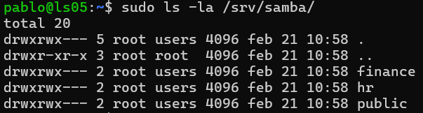

### Step 3: Configure Samba Shares

Edit `/etc/samba/smb.conf` and add after the `[netlogon]` section:

```bash
sudo nano /etc/samba/smb.conf
```

```ini
# Global parameters
[global]
        dns forwarder = 192.168.1.2 8.8.8.8
        netbios name = LS05
        realm = LAB05.LAN
        server role = active directory domain controller
        workgroup = LAB05
        idmap_ldb:use rfc2307 = yes

[sysvol]
        path = /var/lib/samba/sysvol
        read only = No

[netlogon]
        path = /var/lib/samba/sysvol/lab05.lan/scripts
        read only = No

#===================== Share Definitions =====================
[FinanceDocs]
    comment = Finance Department Documents
    path = /mnt/data/shares/finance
    valid users = @Finance, @"Domain Admins"
    read only = no
    browseable = yes
    create mask = 0660
    directory mask = 0770
[HRDocs]
    comment = HR Department Documents
    path = /mnt/data/shares/hr
    valid users = @HR_Staff, @"Domain Admins"
    read only = no
    browseable = yes
    create mask = 0660
    directory mask = 0770
[Public]
    comment = Public Shared Documents (Read-Only)
    path = /mnt/data/shares/public
    valid users = @"Domain Users"
    read only = yes
    browseable = yes
    write list = @"Domain Admins"
```

Verify syntax and reload:
```bash
testparm
sudo systemctl reload samba-ad-dc
smbclient -L localhost -U administrator
```

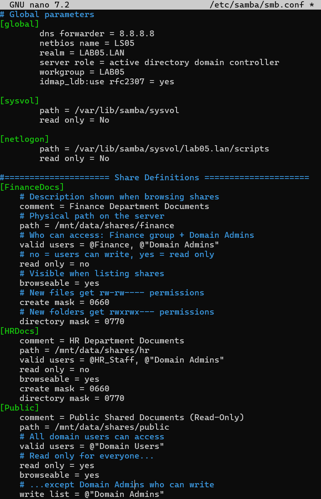

### Step 4: Configure ACLs

ACLs (Access Control Lists) provide granular permissions beyond basic POSIX. Domain groups are referenced with the `LAB05\` prefix via winbind.

**FinanceDocs — R/W with sticky bit** (prevents deleting other users' files):
```bash
sudo setfacl -m "g:LAB05\\finance:rwx" /mnt/data/shares/finance
sudo setfacl -d -m "g:LAB05\\finance:rwx" /mnt/data/shares/finance
sudo chmod +t /mnt/data/shares/finance
```

**HRDocs — normal R/W:**
```bash
sudo setfacl -m "g:LAB05\\hr_staff:rwx" /mnt/data/shares/hr
sudo setfacl -d -m "g:LAB05\\hr_staff:rwx" /mnt/data/shares/hr
```

**Public — read only:**
```bash
sudo setfacl -m "g:LAB05\\domain users:rx" /mnt/data/shares/public
sudo setfacl -d -m "g:LAB05\\domain users:rx" /mnt/data/shares/public
```

Verify all ACLs:
```bash
for dir in finance hr public; do
    echo "=== $dir ==="
    sudo getfacl /mnt/data/shares/$dir
    echo
done
```

> **What does the sticky bit do?** Users can create files, but can only delete files they own. Root and Domain Admins can delete anything. The `T` flag appears in `ls -la` output.

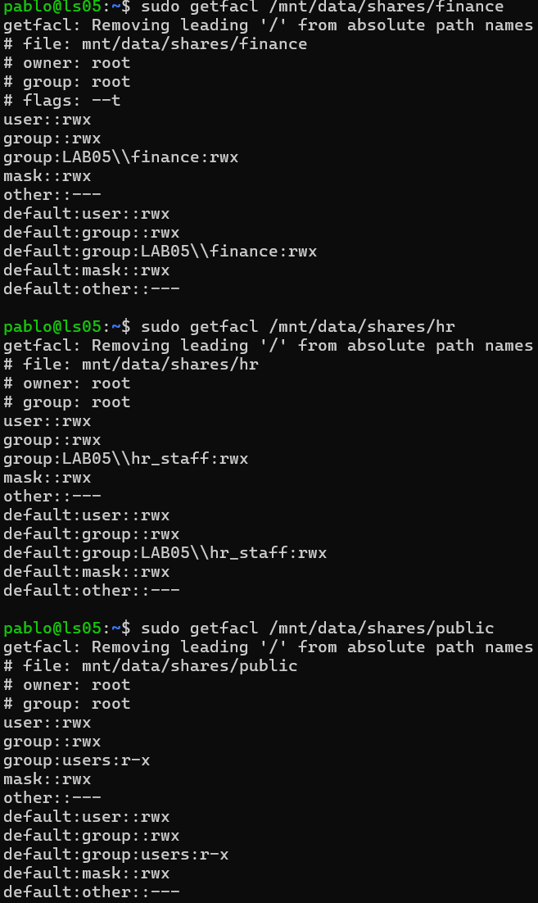

### Step 5: Automated Backup with Cron

Create a backup script that compresses the shares daily and retains the last 7 backups:

```bash
sudo nano /usr/local/bin/backup_shares.sh
```

Content:
```bash
#!/bin/bash
# Automated backup for Samba shared folders
BACKUP_DIR="/backup/samba"
DATE=$(date +%Y%m%d_%H%M%S)

mkdir -p "$BACKUP_DIR"
tar -czf "$BACKUP_DIR/samba_backup_$DATE.tar.gz" -C /mnt/data shares

# Keep only last 7 backups
cd "$BACKUP_DIR" && ls -t *.tar.gz 2>/dev/null | tail -n +8 | xargs -r rm

echo "Backup completed: $DATE" >> "$BACKUP_DIR/backup.log"
```

Make executable and test:
```bash
sudo chmod +x /usr/local/bin/backup_shares.sh
sudo /usr/local/bin/backup_shares.sh
ls -lh /backup/samba/
```

Schedule with cron (daily at 19:00):
```bash
(sudo crontab -l 2>/dev/null; echo "0 19 * * * /usr/local/bin/backup_shares.sh >> /var/log/samba_backup.log 2>&1") | sudo crontab -
sudo crontab -l
```

Cron syntax reference:
```
*    *    *    *    *
│    │    │    │    │
│    │    │    │    └── Day of week (0-7, 0=Sunday)
│    │    │    └─────── Month (1-12)
│    │    └──────────── Day of month (1-31)
│    └───────────────── Hour (0-23)
└────────────────────── Minute (0-59)
```

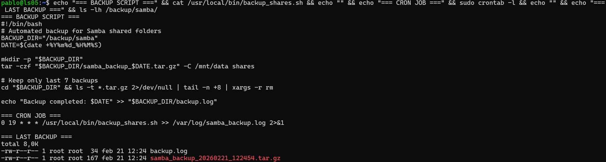

### Sprint 3 Summary

✅ Dedicated disk partitioned, formatted and mounted at /mnt/data
✅ 3 shared folders created with correct ownership
✅ Shares configured in smb.conf with group-based access
✅ Granular ACLs applied using domain group names
✅ Sticky bit on Finance (prevent unauthorized deletion)
✅ Automated daily backup configured with cron

---

## Sprint 4: Forest Trust Between Domains

**Duration:** 6 hours
**Objective:** Create a second AD domain and establish bidirectional forest trust.

### Architecture

```
Forest 1: lab05.lan               Forest 2: lab06.lan
├── DC: ls05.lab05.lan            ├── DC: ls06.lab06.lan
├── IP: 192.168.1.1               ├── IP: 192.168.1.2
└── Users: 8                      └── Users: 2
            │
            │ ◄──── Forest Trust (Bidirectional) ────►
            │
```

### Domain Comparison

| Parameter | lab05.lan | lab06.lan |
|-----------|-----------|-----------|
| **Hostname** | ls05.lab05.lan | ls06.lab06.lan |
| **Realm** | LAB05.LAN | LAB06.LAN |
| **Internal IP** | 192.168.1.1 | 192.168.1.2 |
| **Bridge IP** | 172.30.20.41 | 172.30.20.42 |
| **DNS Secondary** | 192.168.1.2 | 192.168.1.1 |

### Step 1: Create Second Domain Controller

Create a new VM and repeat Sprint 1 with these differences:

- **Hostname:** `ls06.lab06.lan`
- **Realm:** `LAB06.LAN`, **Domain:** `LAB06`
- **Internal IP:** `192.168.1.2/24`
- **Bridge IP:** `172.30.20.42/25`

Netplan for ls06:
```yaml
network:
  version: 2
  ethernets:
    enp0s3:
      dhcp4: no
      addresses:
        - 172.30.20.42/25
      routes:
        - to: default
          via: 172.30.20.1
      nameservers:
        addresses: [127.0.0.1, 10.239.3.7]
        search: [lab06.lan]
    enp0s8:
      dhcp4: no
      addresses:
        - 192.168.1.2/24
      nameservers:
        addresses: [127.0.0.1, 192.168.1.1]
        search: [lab06.lan]
```

`/etc/hosts` on ls06:
```
127.0.0.1 localhost
192.168.1.2 ls06.lab06.lan ls06
192.168.1.1 ls05.lab05.lan ls05
```

Provision the LAB06 domain:
```bash
sudo samba-tool domain provision --use-rfc2307 --interactive
# Realm: LAB06.LAN, Domain: LAB06, DNS: SAMBA_INTERNAL, Password: Admin_21
```

Start the service (same as Sprint 1 Step 8):
```bash
sudo cp /var/lib/samba/private/krb5.conf /etc/krb5.conf
sudo systemctl unmask samba-ad-dc
sudo systemctl enable samba-ad-dc
sudo systemctl start samba-ad-dc
```

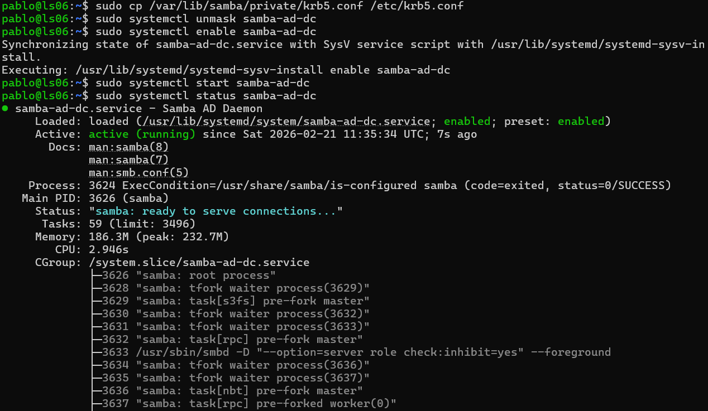

Verify:
```bash
sudo samba-tool domain level show
sudo samba-tool domain info 127.0.0.1
host -t A ls06.lab06.lan
```

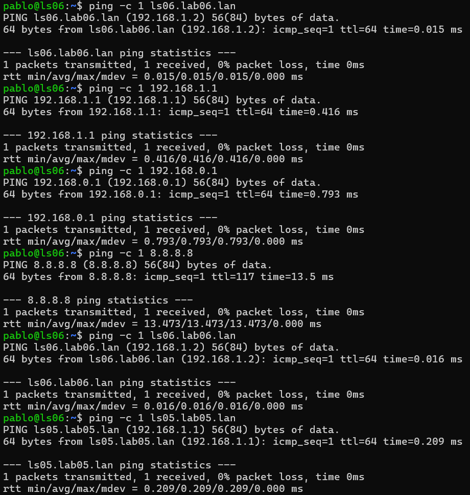

### Step 2: Configure DNS Forwarding

Each DC must be able to resolve the other domain. Add the other DC's IP as the first DNS forwarder.

**On ls05 (lab05.lan):**
```bash
sudo nano /etc/samba/smb.conf
```
Change the `dns forwarder` line to:
```ini
dns forwarder = 192.168.1.2 10.239.3.7
```
```bash
sudo systemctl reload samba-ad-dc
```

**On ls06 (lab06.lan):**
```bash
sudo nano /etc/samba/smb.conf
```
Change the `dns forwarder` line to:
```ini
dns forwarder = 192.168.1.1 10.239.3.7
```
```bash
sudo systemctl reload samba-ad-dc
```

**Test cross-domain DNS resolution from ls05:**
```bash
host -t A ls06.lab06.lan
host -t SRV _ldap._tcp.lab06.lan
```

**Test from ls06:**
```bash
host -t A ls05.lab05.lan
host -t SRV _ldap._tcp.lab05.lan
```


Both must resolve correctly before proceeding.

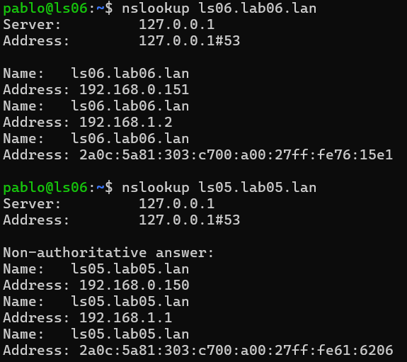

### Step 3: Create Forest Trust

From ls05, create a bidirectional forest trust:

```bash
sudo samba-tool domain trust create lab06.lan \
  --type=forest \
  --direction=both \
  -U administrator@lab06.lan
```

Password: `Admin_21`


### Step 4: Verify Trust

```bash
# List trusts
sudo samba-tool domain trust list

# Show trust details
sudo samba-tool domain trust show lab06.lan

# Validate trust
sudo samba-tool domain trust validate lab06.lan
```

> **Note:** A netlogon error during validation is normal in Samba 4. The important lines are:
> `OK: LocalValidation: DC[\\ls06.lab06.lan] CONNECTION[WERR_OK] TRUST[WERR_OK]`

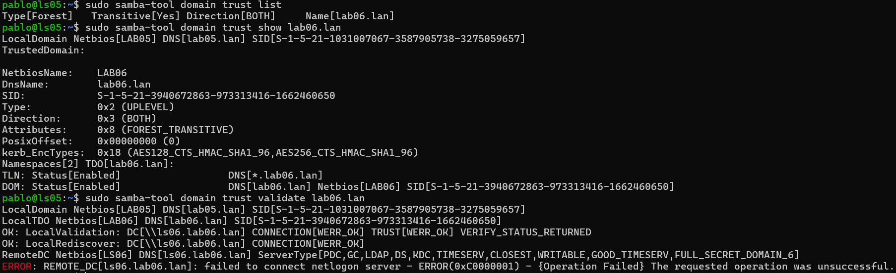

### Step 5: Test Cross-Domain Authentication

Create test users on ls06:
```bash
sudo samba-tool user create testuser 'P@ssw0rd2026!' --given-name=Test --surname=User
sudo samba-tool user create testuser2 'P@ssw0rd2026!' --given-name=Test2 --surname=User
```

**From ls05**, authenticate as a LAB06 user:
```bash
kinit testuser@LAB06.LAN
# Password: P@ssw0rd2026!
klist
kdestroy
```

**From ls06**, authenticate as a LAB05 user:
```bash
kinit alice@LAB05.LAN
# Password: P@ssw0rd2026!
klist
kdestroy
```

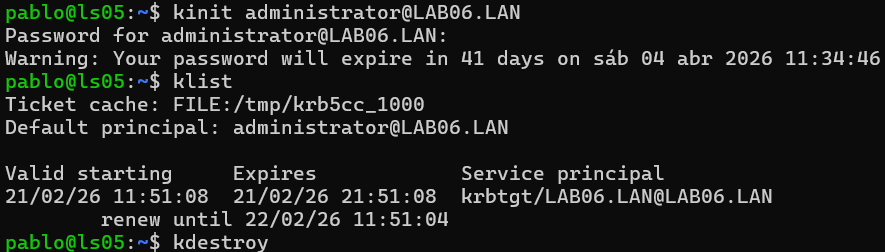

### Sprint 4 Summary

✅ Second DC (ls06.lab06.lan) created and provisioned
✅ DNS forwarding configured on both DCs
✅ Bidirectional forest trust established
✅ Trust validated (WERR_OK)
✅ Cross-domain Kerberos authentication working

---

## Sprint 5: AWS Cloud Deployment

**Duration:** 2 sessions

**Objective:** Deploy Ubuntu Server 24.04 as Samba 4 AD Domain Controller and Windows Server 2025 as a domain client on AWS EC2, with full connectivity verification.

### Infrastructure Summary

| Parameter | Ubuntu Server (DC) | Windows Server (Client) |
|-----------|-------------------|------------------------|
| **Instance type** | t3.small | t3.small |
| **AMI** | Ubuntu Server 24.04 LTS | Windows Server 2025 Base |
| **Elastic IP** | 54.173.102.89 | 54.221.100.222 |
| **Private IP** | 10.0.1.229 | 10.0.14.107 |
| **VPC** | LAB05-VPC (vpc-0f228f5e15f2bf4ae) | LAB05-VPC (vpc-0f228f5e15f2bf4ae) |
| **Key pair** | ubuntu-server.pem | ubuntu-server.pem |

> ⚠️ Private IPs (10.0.x.x) persist across stop/start cycles. Elastic IPs are fixed public IPs that also persist.

### Step 1: Security Group Configuration

Both instances share the **LAB05-SG** security group within the same VPC.

| Port | Protocol | Source | Description |
|------|----------|--------|-------------|
| 22 | TCP | 0.0.0.0/0 | SSH |
| 3389 | TCP | 0.0.0.0/0 | RDP |
| 53 | TCP/UDP | 10.0.0.0/20 | DNS |
| 88 | TCP/UDP | 10.0.0.0/20 | Kerberos |
| 389 | TCP | 10.0.0.0/20 | LDAP |
| 445 | TCP | 10.0.0.0/20 | SMB/CIFS |
| 636 | TCP | 10.0.0.0/20 | LDAPS |
| 3268 | TCP | 10.0.0.0/20 | Global Catalog |
| 3269 | TCP | 10.0.0.0/20 | Global Catalog SSL |
| All traffic | All | 10.0.0.0/20 | Internal VPC communication |

AD ports are restricted to the internal VPC subnet for security. SSH and RDP are open from anywhere for exam access.


### Step 2: Launch Instances in LAB05 VPC

Both instances must be in the same VPC so they communicate via private IP. Under **Network settings** when launching each instance:

- VPC: `vpc-0f228f5e15f2bf4ae (LAB05-VPC-vpc)`
- Subnet: `LAB05-VPC-subnet-public1-us-east-1a`
- Auto-assign public IP: **Enable**
- Security group: **LAB05-SG**

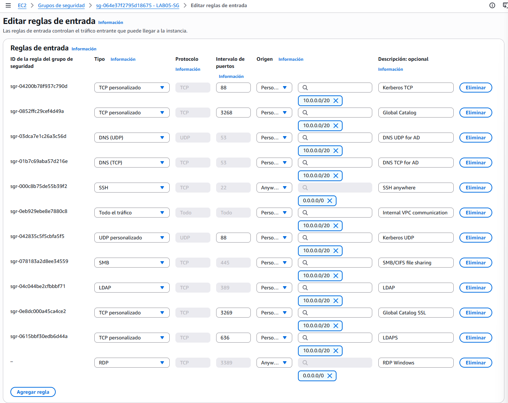

### Step 3: Assign Elastic IPs

Elastic IPs prevent public IP changes on instance restart.

**EC2 → Elastic IPs → Allocate Elastic IP** (repeat twice, label them `elastica-ubuntu` and `elastica-windows`), then associate each to its instance.

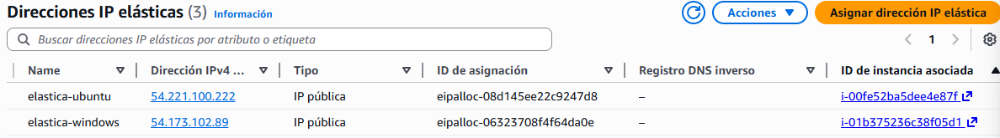

### Step 4: Get Windows Administrator Password

**EC2 → Instances → windows-server → Actions → Security → Get Windows Password**

Upload `ubuntu-server.pem` → click **Decrypt Password** → save the password securely.

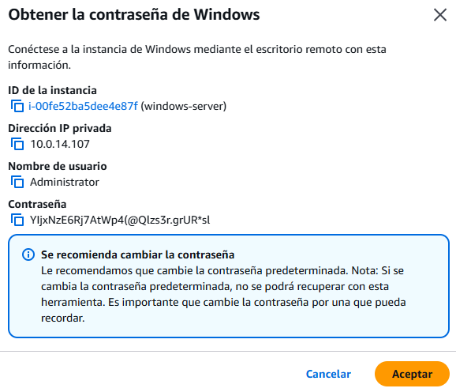

### Step 5: Configure Windows Server

**Connect via RDP** from a Linux machine:

```bash
# Install FreeRDP if not present
sudo apt install freerdp2-x11

# Connect
xfreerdp /v:54.221.100.222 /u:Administrator /p:'YourPassword' /cert:ignore /dynamic-resolution /clipboard
```

**Change password and set Spanish keyboard** (from PowerShell inside RDP):

```powershell
# Change Administrator password to something memorable
net user Administrator admin_21

# Set Spanish keyboard layout
Set-WinUserLanguageList -LanguageList es-ES -Force
```

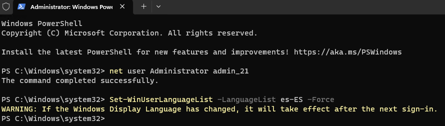

**Allow ICMP (ping) through Windows Firewall:**

```powershell
netsh advfirewall firewall add rule name="ICMP Allow" protocol=icmpv4:8,any dir=in action=allow
```

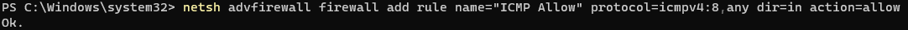

### Step 6: SSH into Ubuntu Server

```bash
ssh -i ubuntu-server.pem ubuntu@54.173.102.89
```

Update the system:

```bash
sudo apt update && sudo apt upgrade -y
```


### Step 7: Connectivity Verification

**Ubuntu → Windows:**

```bash
ping -c 4 10.0.14.107
```

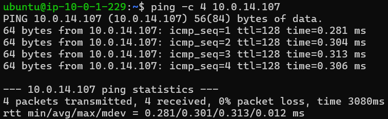

**Windows → Ubuntu** (PowerShell):

```powershell
ping 10.0.1.229

Test-NetConnection -ComputerName 10.0.1.229 -Port 22

# This will fail until Samba is installed — expected
Test-NetConnection -ComputerName 10.0.1.229 -Port 389
```

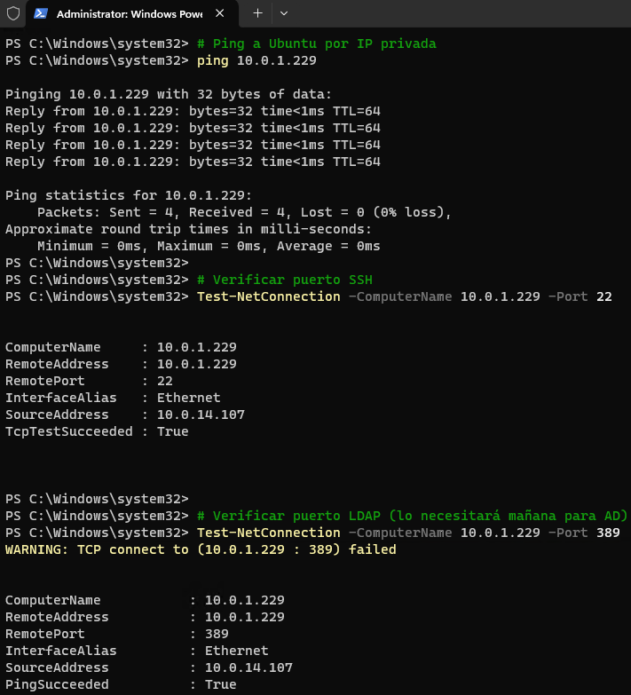

### Step 8: Install Samba AD on Ubuntu Server (Exam Day)

AWS manages networking via DHCP, so no Netplan changes are needed. Key differences from Sprint 1:

**Disable systemd-resolved:**
```bash
sudo systemctl disable --now systemd-resolved
sudo unlink /etc/resolv.conf
sudo nano /etc/resolv.conf
```
Content:
```
nameserver 127.0.0.1
nameserver 8.8.8.8
search lab05.lan
```

**Configure /etc/hosts:**
```bash
sudo nano /etc/hosts
```
Content:
```
127.0.0.1 localhost
10.0.1.229 ls05.lab05.lan ls05
```

**Install Samba** (same as Sprint 1):
```bash
sudo apt install -y acl attr samba samba-dsdb-modules samba-vfs-modules \
  winbind libpam-winbind libnss-winbind libpam-krb5 krb5-config krb5-user \
  dnsutils ldap-utils
```

**Provision the domain:**
```bash
sudo samba-tool domain provision --use-rfc2307 --interactive
# Realm: LAB05.LAN, Domain: LAB05, DNS: SAMBA_INTERNAL, forwarder: 8.8.8.8
```

### Step 9: Join Windows Server to Domain (Exam Day)

**1. Set DNS on Windows network adapter to point to Ubuntu:**

Control Panel → Network and Sharing Center → Change adapter settings → Ethernet → Properties → IPv4

- **Preferred DNS:** `10.0.1.229`
- **Alternate DNS:** `8.8.8.8`

**2. Join the domain:**

System Properties → Change settings → Change → Domain → `lab05.lan`

Credentials: `Administrator` / `Admin_21` → Restart.

### Step 10: Verify Shared Folders from Windows (Exam Day)

After restarting and logging in with a domain account, open File Explorer and navigate to:

```
\\ls05.lab05.lan\Public
\\10.0.1.229\Public
```

### Sprint 5 Summary

| Task | Status |
|------|--------|
| Ubuntu Server EC2 launched (LAB05-VPC) | ✅ |
| Windows Server EC2 launched (LAB05-VPC) | ✅ |
| LAB05-SG security group configured | ✅ |
| Elastic IPs assigned (persistent) | ✅ |
| RDP from local machine to Windows | ✅ |
| SSH from local machine to Ubuntu | ✅ |
| Bidirectional connectivity verified | ✅ |
| Windows password + Spanish keyboard | ✅ |
| Samba AD installation | ⏳ Exam day |
| Windows joined to domain | ⏳ Exam day |
| Shared folders verified from Windows | ⏳ Exam day |

---

## Appendix A: Ubuntu Desktop Client

**Hostname:** lslc
**IP Address:** 192.168.1.10
**Domain:** lab05.lan
**OS:** Ubuntu Desktop 24.04

### Phase 1: Install Packages (With Internet Access)

Before switching to the internal-only network, install all required packages while you have internet:

```bash
sudo apt update
sudo apt install -y realmd sssd sssd-tools libnss-sss libpam-sss \
  adcli samba-common-bin packagekit krb5-user cifs-utils smbclient
```

When prompted for Kerberos:
- **Default realm:** `LAB05.LAN`
- **Kerberos servers:** `ls05.lab05.lan`
- **Admin server:** `ls05.lab05.lan`

### Phase 2: Configure Network (Internal Only)

Switch the VM to internal network only (`intnet` in VirtualBox). Configure static IP via the GNOME Settings GUI:

- **Address:** 192.168.1.10
- **Netmask:** 255.255.255.0
- **Gateway:** 192.168.1.1
- **DNS:** 192.168.1.1

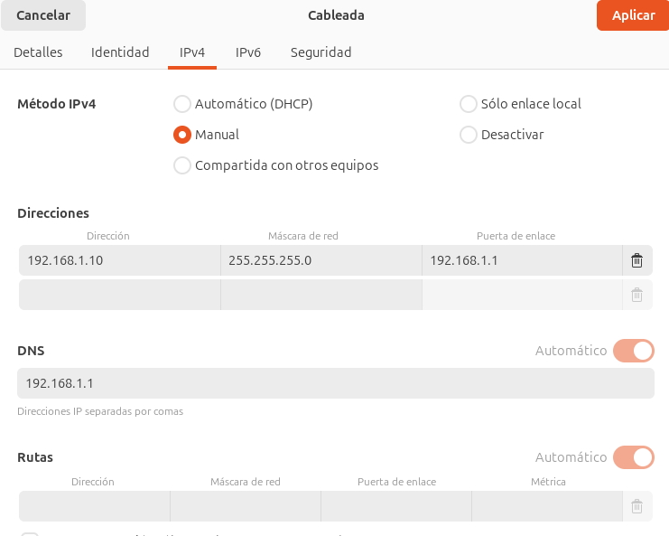

Configure hostname and DNS resolution:
```bash
sudo hostnamectl set-hostname lslc
```

Edit `/etc/hosts`:
```
127.0.0.1 localhost
127.0.1.1 lslc
192.168.1.10 lslc.lab05.lan lslc
```

Edit `/etc/resolv.conf`:
```
nameserver 192.168.1.1
search lab05.lan
```

Verify connectivity to the domain controller:
```bash
ping -c 2 192.168.1.1
nslookup lab05.lan
nslookup ls05.lab05.lan
```

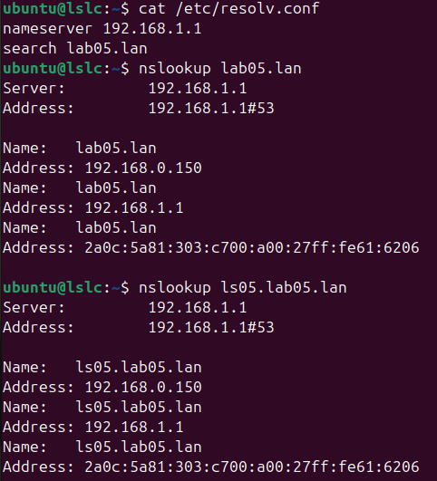

### Phase 3: Discover and Join Domain

Discover the domain:
```bash
sudo realm discover lab05.lan
```

Expected output should show `type: kerberos` and `server-software: active-directory`.

Join the domain:
```bash
sudo realm join --verbose --user=administrator lab05.lan
```

Password: `Admin_21`

The output should end with: `Successfully enrolled machine in realm`

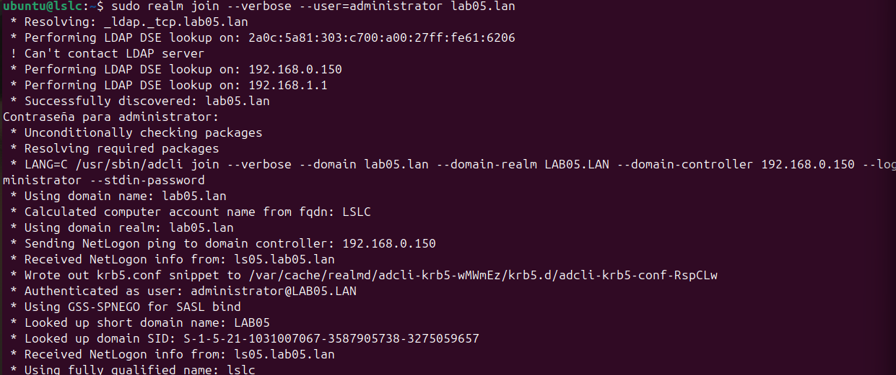

Verify the join:
```bash
realm list
```

Should show `configured: kerberos-member`.

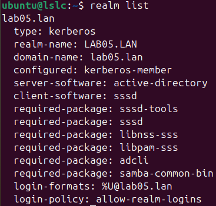

### Phase 4: Configure PAM for Domain Users

Enable domain authentication and automatic home directory creation:

```bash
sudo pam-auth-update
```

Ensure these are checked:
- ✅ **SSS authentication**
- ✅ **Create home directory on login**


### Phase 5: Test Domain Login

Test login from terminal:
```bash
sudo su - alice@lab05.lan
whoami
id
pwd
exit
```

Test GUI login: log out, click **"Not listed?"**, and enter `alice@lab05.lan` with password `P@ssw0rd2026!`.

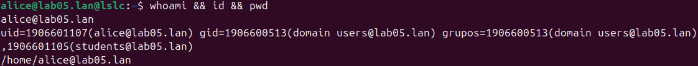

### Phase 6: Access Shared Folders

Mount a share using CIFS to verify end-to-end access:

```bash
sudo mkdir -p /mnt/public
sudo mount -t cifs //192.168.1.1/Public /mnt/public \
  -o username=alice,password='P@ssw0rd2026!',domain=LAB05,vers=3.0
ls -la /mnt/public/
mount | grep cifs
```

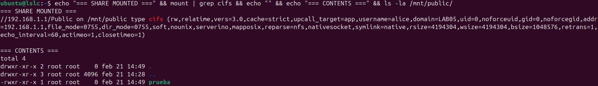

> **Alternative:** From the GNOME file manager, press `Ctrl+L` and type `smb://192.168.1.1/Public`.

### Appendix A Summary

✅ SSSD + Realmd installed and configured
✅ Ubuntu Desktop joined to lab05.lan
✅ PAM configured for domain users + home directory auto-creation
✅ Domain login working (terminal and GUI)
✅ Shared folder access verified via CIFS

---

## Appendix B: Windows 11 Client

**Hostname:** wc-05
**IP Address:** 192.168.1.100
**Domain:** lab05.lan
**OS:** Windows 11 Professional

> **Requirement:** Windows 11 **Home** cannot join domains. You need **Pro** or **Enterprise**.

### Step 1: Configure Network

Set the VM to internal network only (`intnet`). Open **Network adapter settings** and configure:

- **IP address:** 192.168.1.100
- **Subnet mask:** 255.255.255.0
- **Default gateway:** 192.168.1.1
- **Preferred DNS:** 192.168.1.1

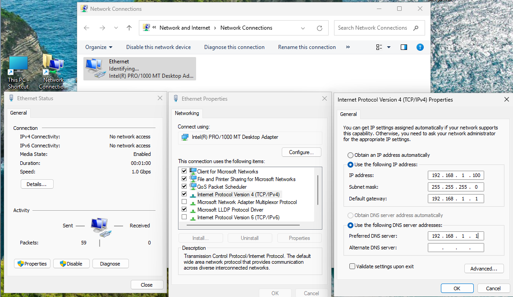

Verify connectivity from Command Prompt:
```cmd
ping 192.168.1.1
nslookup lab05.lan
```

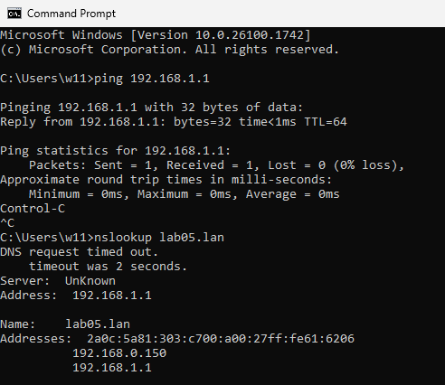

### Step 2: Join Domain

1. Press `Win+R` → type `sysdm.cpl` → **Computer Name** tab → **Change...**
2. Select **Domain** and type: `lab05.lan`
3. Enter credentials: `administrator` / `Admin_21`
4. **"Welcome to the lab05.lan domain"** message appears
5. Restart the computer

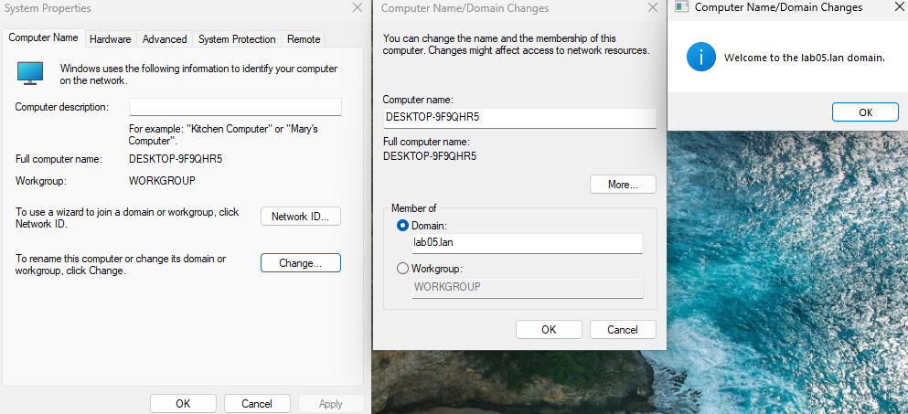

### Step 3: Login as Domain User

After reboot:

1. Click **Other user** on the login screen
2. Enter: `LAB05\alice` / `P@ssw0rd2026!`
3. First login will be slow (Windows creates the user profile)

Verify from Command Prompt:
```cmd
whoami
net user alice /domain
```

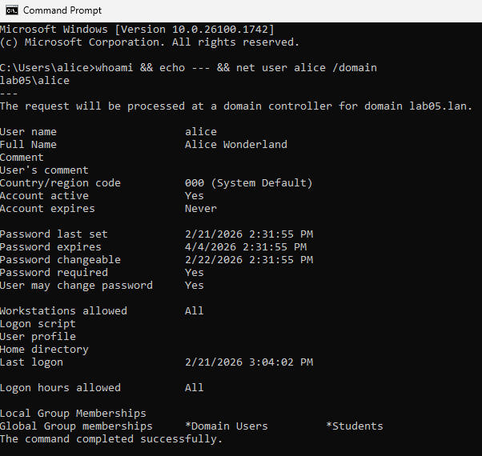

### Step 4: Access Shared Folders

Open **File Explorer** and type in the address bar:
```
\\ls05.lab05.lan
```

Available shares appear: FinanceDocs, HRDocs, Public (visibility depends on group membership).

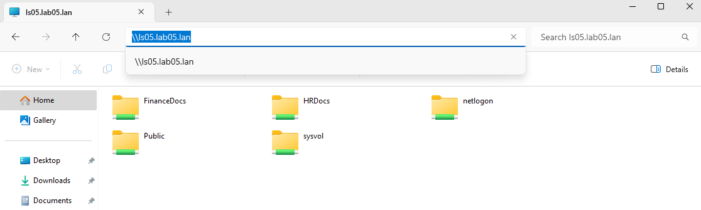

### Appendix B Summary

✅ Windows 11 Pro joined to lab05.lan
✅ Domain user login working
✅ Network shares accessible from File Explorer
✅ DNS resolution and Kerberos authentication functional

---

## Document Information

| Field | Value |
|-------|-------|
| **Project** | LAB05 - Samba 4 Active Directory |
| **Version** | 4.0 |
| **Last Updated** | February 2026 |
| **Environment** | Laboratory / Testing |
| **Total Duration** | ~31 hours |

---

**End of Implementation Guide**
